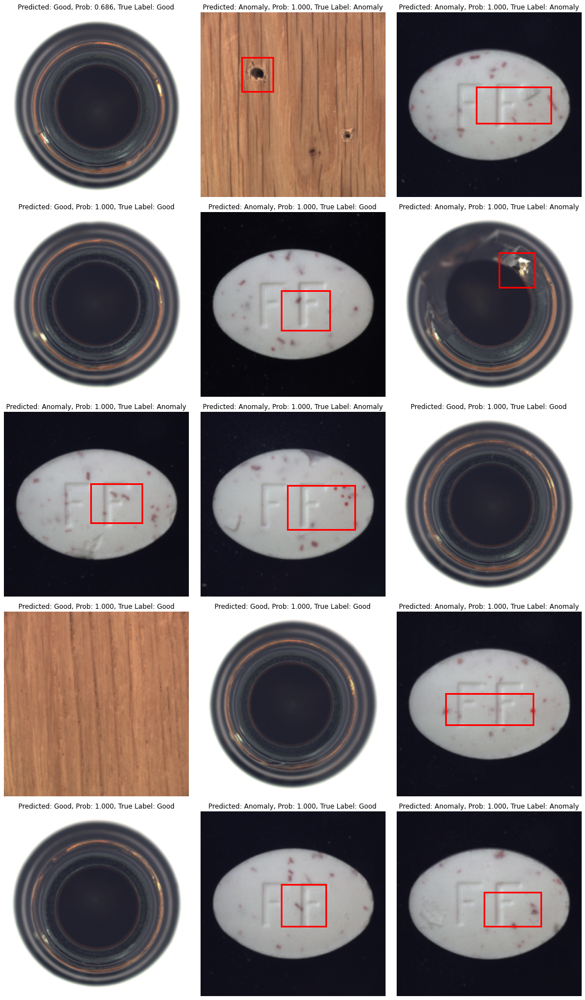
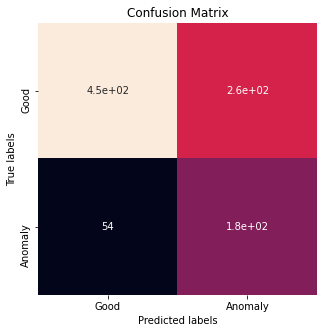

# Project Name: SimCLR Frame-work for defect detection on unknown context

## This is the modidied VGG16 baseline model for the project. The baseline model will be compared to the performance of the SimCLR model.

**This work is built on previous work by Olga Chernytska and Olha Chernytska. [GitHub repository: Visual-Inspection](https://github.com/OlgaChernytska/Visual-Inspection)**


## Architecture

**Training.**
VGG16 feature extractor pre-trained on ImageNet, classification head - Average Global Pooling and a Dense layer. Model outputs 2-dimensional vector that contains probabilities for class 'Good' and class 'Anomaly'. Finetuned only last 3 convolutional layers and a dense layer. Loss is Cross-Entropy; optimizer is Adam with a learning rate of 0.0001.


*Model Training Pipeline: (image by Olga Chernytska and Olha Chernytska)*


**Inference.**
During inference model outputs probabilities as well as the heatmap. Heatmap is the linear combination of feature maps from layer conv5-3 weighted by weights of the last dense layer, and upsampled to match image size. From the dense layer, we take only weights that were used to calculate the score for class 'defective'. 

For each input image, model returns a single heatmap. High values in the heatmap correspond to pixels that are very important for a model to decide that this particular image is defective. This means, that high values in the heatmap show the actual location of the defect. Heatmaps are processed further to return bounding boxes of the areas with defects.

*Model Inference Pipeline: (image by Olga Chernytska and Olha Chernytska)*


*Detailed architecture of the model classification head: (image by Olga Chernytska and Olha Chernytska)*


*The final heatmap is calculated as the sum of Conv5-3 layer heatmaps each multiplied by the weight in the Dense layer that affected 'Anomaly' class score: (image by Olga Chernytska and Olha Chernytska)*


*How to process heatmap into the bounding box: (image by Olga Chernytska and Olha Chernytska)*


## Data

 - Dataset used - [MVTEC Anomaly Detection Dataset](https://www.mvtec.com/company/research/datasets/mvtec-ad). This dataset is released under the [Creative Commons Attribution-NonCommercial-ShareAlike 4.0 International](https://creativecommons.org/licenses/by-nc-sa/4.0/) License (CC BY-NC-SA 4.0), which means it is not allowed to use it for commercial purposes.
 - Images resized to 224x224.
 - To use the dataset, download the datasets for the object types you want to train/test with, put the entire folder with the name of the object under a directory named data. Then the dataloader will be able to load all images from that dataset with 'good' and 'anomaly' labels and details of labels, e.g., 'good', 'crack', 'hole', etc.


## Evaluation
Evaluation was performed on 3 subsets from the MVTEC Anomaly Detection Dataset - Bottle, Pill, and Wood. A single model was trained for all 3 subsets. Class weighing in loss function - 1 for 'Good' class and 3 for 'Anomaly'. The model was trained for at most 10 epochs with early stopping if train set accuracy reaches 98%.

**Results**

The model was trained with data subsets Capsule, Hazelnut, and Leather.
The model was tested with data subsets Bottle, Pill, and Wood.
| Metrics | Value |
| --- | --- |
| Precision: | 89.3% |
| Recall: | 63.4% |
| F1 score: | 0.74 |

| Subset Name | N Images <br /> (Train / Test) | Test Set <br /> Accuracy | Test Set <br /> Balanced Accuracy | Test Set <br /> Confusion Matrix |
| --- | --- | --- | --- | --- |
| Bottle, Pill, and Wood | 1221 / 944 | 66.6% | 70.2% | TP=450 (47.6%), FN=260 (27.5%), <br /> FP=54 (5.7%), TN=180 (19.0%) |

<br><br>

*Bottle, Pill, and Wood: Prediction on Test Set* <br>


**Confusion Matrix of the test results** <br>



## Project Structure

- ```baseline.py``` - main executable file for training, evaluation, and visualization
- ```Training.ipynb``` - notebook with training, evaluation and visualization
- ```utils/model.py``` - file with model class 
- ```utils/dataloder.py``` - file with dataloader
- ```utils/helper.py``` - other functions used in the project
- ```utils/constants.py``` - constants used in the project
- ```weights/``` - folder with trained models


## References

Olga Chernytska and Olha Chernytska, [GitHub repository: Visual-Inspection](https://github.com/OlgaChernytska/Visual-Inspection)**

Zhou, Bolei, Aditya Khosla, Agata Lapedriza, Aude Oliva, and Antonio Torralba: Learning deep features for discriminative localization; in: Proceedings of the IEEE conference on computer vision and pattern recognition, 2016. [pdf](https://arxiv.org/pdf/1512.04150.pdf)

Paul Bergmann, Kilian Batzner, Michael Fauser, David Sattlegger, Carsten Steger: The MVTec Anomaly Detection Dataset: A Comprehensive Real-World Dataset for Unsupervised Anomaly Detection; in: International Journal of Computer Vision, January 2021. [pdf](https://link.springer.com/content/pdf/10.1007/s11263-020-01400-4.pdf)

Paul Bergmann, Michael Fauser, David Sattlegger, Carsten Steger: MVTec AD – A Comprehensive Real-World Dataset for Unsupervised Anomaly Detection;
in: IEEE Conference on Computer Vision and Pattern Recognition (CVPR), June 2019. [pdf](https://www.mvtec.com/fileadmin/Redaktion/mvtec.com/company/research/datasets/mvtec_ad.pdf)


## License
This project is licensed under the terms of the [MIT license](https://choosealicense.com/licenses/mit/).
